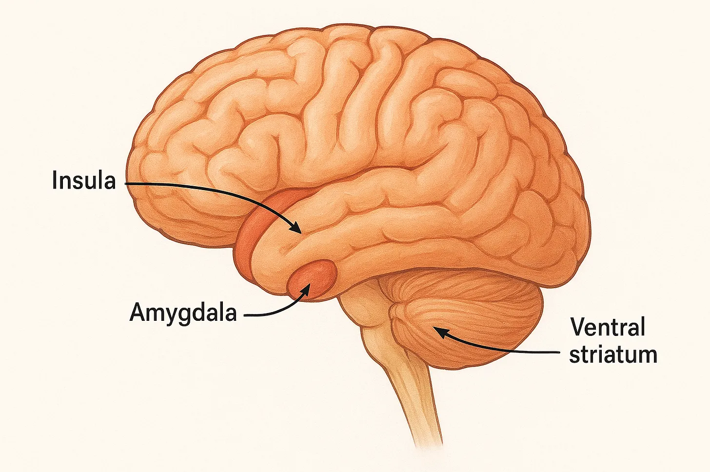
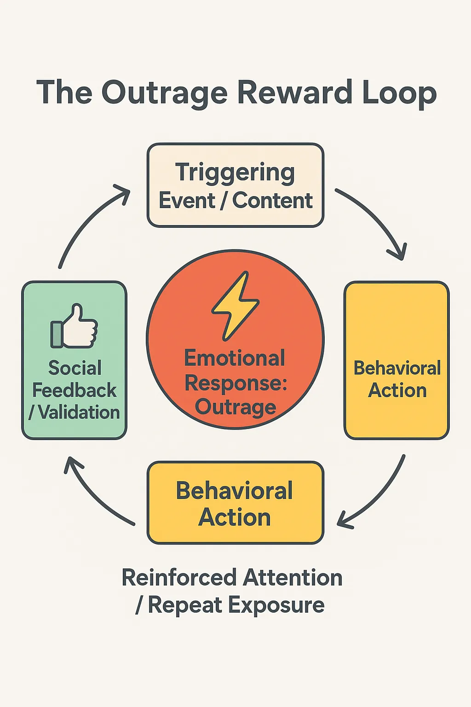

# What happens when ancient emotional circuits collide with modern algorithmic incentives.
 
Al Monney 
December 17, 2025 
## **When Outrage is an Unexpected Comfort**

In this era of digital information overload, political conflict, and unending certainty, outrage has become the normalized emotional response. Those responses are demonstrated inside the multiple social platforms, news outlets, and even in interpersonal interactions. Even though it is treated as principled or virtuous, since it often suggests moral positioning or political participation, outrage also provides clarity, energy, and direction, but the kind that is antithetical to slow, methodical analysis in a world where people feel overwhelmed by ambiguity.

It isn’t coincidental that during periods of societal havoc, as we currently witness in American and European cities, uncertainty and strained coping mechanisms rise, and as a result, so does outrage.

The main idea I propose with this article is that outrage is similar to a short-term psychological reward. As brief as the reward may be, it turns discomfort into certainty and provides a sense of control. This effect begins with the brain’s real-time prioritization system for what deserves immediate attention (emotional salience), threat, and reward. What we often perceive as instantaneous emotional responses are in fact a coordinated cerebral process that transforms anxiety into direct, triggering emotions. It’s specifically this sequence of brain processing events—its neural, cognitive, and social parameters—that helps us to understand why outrage is common and also self-reinforcing. Outrage isn’t merely a random emotion or a moral stance. It’s actually a powerful and reliable force in human behaviour because it uses three systems to amplify it. When we look at how the brain, cognition, and social networks all work together, we begin to see why outrage is the most reliable way of hijacking an individual’s focus and transforming it into real, measurable action.

## **The Neuropsychological Foundation of Outrage**

### **A. The Outrage Pathway: A Brief Primer**

When the brain detects information that is emotionally significant, outrage kicks in. This detection is far from objective. What your brain has learned throughout your personal life history determines the emotional response, and salience detection triggers this process through the insula part of the brain. (Kensinger, 2004).

For example, a news headline outlining corruption or an injustice, with which you strongly identify for experiential reasons, instantly engages your brain’s insula alert system, indicating that this piece of information demands your attention.

Once this piece of information is highlighted as important, the signal quickly moves to the amygdala, which handles the threat and anger assessment. This millisecond response pattern has been documented in affective neuroscience (LeDoux, 2012). The result of the amygdala’s processing is an amplified emotional arousal and the rise of that familiar feeling of moral indignation.

What happens next is an evaluation of the conflict, violations, and errors by the anterior cingulate cortex (ACC). The anterior cingulate cortex (ACC) then acts as the moral alarm by flagging the ACC’s social and ethical discrepancies (Botvinick et al., 2004).

In the final phase, the pathway activates a key reward hub in the ventral striatum part of the brain to deliver a brief dopamine burst when the ambiguity is resolved (Berridge & Robinson, 2016). The moment the reward is delivered can be likened to the feeling of satisfaction after solving an important problem or receiving needed approval.

This highly coordinated effort turns ambiguous negative emotions into a sharpened instrument of anger aimed at one clear target. Recognizing this choreography provides a good understanding of why outrage feels like it’s instantaneous and compelling. The brain is executing a highly efficient sequence of neural events.

While outrage feels instantaneous, it is the result of a rapid relay across several neural structures. The following diagram provides a simplified flow of the outrage pathway.

### **B. Emotional Triggering and Cognitive Simplification**

From an evolutionary perspective, outrage intentionally prepares us for fight-or-flight. It narrows our attention and simplifies our ability to think slowly **(Kensinger, 2004)**. In other words, if something feels morally wrong or threatening, then we step into survival mode. Strong emotional responses use that emergency system. When we perceive a threat, we’re designed to respond fast, not dwell on it. Anxiety, as opposed to outrage, is diffuse, ambiguous, and emotionally strenuous, whereas outrage is narrow, crystal clear, and highly mobilizing.

Anger achieves different results than other emotions. Unlike other emotions like fear, shame, sadness, and anxiety, anger propels us toward the source of the problem **(Nabi, 2002)**. Often, people shift from anxiety to anger because it makes them feel more powerful and back in control **(Lerner et al., 2003)**. This synergistic interaction between focus and control explains why outrage feels good. From a social standpoint, emotional clarity coming from outrage can result in activism, collective behaviours, or comments on social platforms, turning emotional triggers into tangible results.

## **Why Outrage Feels Better Than Anxiety**

The problem with anxiety is that it often leaves us powerless but with a continued feeling of unease. Clarifying a goal, defining a cause, or turning a response into an action are things that outrage achieves, which often resolve the feelings of anxiety. The shift is psychologically effective, which is why, in therapeutic circles, taking some sort of action is frequently recommended when feeling anxiety, despair, and depression. Helplessness is overcome by intent. Being concerned about a political issue can feel as though you are powerless. Outrage at the political issue propels you toward practical engagement in helping to resolve the issue.

Research shows that anger makes us perceive risks as more predictable and controllable, as opposed to fear and anxiety (Lerner et al., 2003). This emotional transformation generates certainty, even if sometimes inaccurate, and activates the reward system (Berridge & Robinson, 2016). Outrage can give us a sense of belonging and additional social benefits while reinforcing a person’s neural rewards.

## **The Outrage Reward Loop: How the Cycle Works**

The process that outrage follows is predictable:

**Trigger:** A news report, social media post or comment, or interpersonal conflict is interpreted as morally or socially significant.

**Arousal:** The emotional barometer is raised, which increases focus and narrows down thinking

**Reward:** The part of the brain called the ventral striatum provides a brief emotional high of certainty and clarity, giving the brain a feeling of momentary control.

**Crash:** The fleeting reward dissipates, and the discomfort resumes, often leading to anxiety

**Rinse-Repeat:** The individual is ready for the next activation, which perpetuates the cycle.

Neuroscience explains this cyclical pattern in terms of a reinforcement-learning model. The old model, now seen as incorrect, was based on the pleasure molecule: dopamine.

**You eat chocolate ⇾ You get a dose of dopamine ⇾ You feel good.**

Today’s understanding is that Dopamine isn’t merely a “feel-good” substance (Schultz, 2015). It’s far more sophisticated. Its true mission is to stamp, **“Whatever you did…do it again!”**

Outrage now becomes the trainer. It teaches the brain to acquire clarity through focused anger. In time, this process contributes to the behaviour of compulsively checking news, posts, or any emotionally primed stimulus.

## **When Biology Meets Technology**

The complete neurobiological and social mechanism for the outrage loop,

**Salience → Anger → Reward → Group bonding → Repeat**

is already hardwired into our brains and has been running finely-tuned for thousands of years in villages, tribes, churches, markets, battlefields, and dinner tables. Social media is only the latest environment to take advantage of the mechanism. Digital media platforms dramatically boost them. Morally-outrageous content or any content, for that matter, that triggers righteous anger, disgust, or awe, spreads like wildfire online and does so with a much greater audience and significantly faster than slow, calm, or just happy content (Brady et al., 2017). Negative emotions such as anger spread much faster than positive ones (Fan et al., 2016). What’s new in our present environment is the algorithmic calculus. Algorithms prioritize content that “ignites” strong reactions, thus creating a personalized feedback loop between the outrage loop—the neural reward—and the platform engagement. Algorithm designers are essentially engineering and pushing the digital era’s most addictive substance: moral outrage. They are the new drug-pushers of the digital world.

Studies are now showing that emotionally charged propaganda diffuses faster than accurate information due to its sensationalistic elements _(Vosoughi, Roy, & Aral, 2018)_.

The process of acquiring social payoffs in the form of likes, retweets, replies, quote-tweets, etc., reinforces the outrage cycle:

**Trigger → Expression → Reward → Repeat**

In addition, when everybody does it, norm learning ensues, leading to a self-sustaining habit. Social media platforms don’t merely host this process; the endless feeds and easy sharing put the whole loop on steroids, transforming mild frustration into a form of endless outrage-posting.

Outrage campaigns that go viral can bring millions together, which demonstrates the combined strength of the brain’s and social media platform’s reward reinforcement mechanism. Such an alignment always ensures that outrage is endlessly rewarded, internally first, then externally. This makes getting off the emotional treadmill difficult.

## **The Crash: How Diminishing Returns and Escalation Follow**

With repeated and endless emotional arousal of the outrage loop, emotional desensitization to moderate events follows (Schultz, 2015). The endless genocide resulting in extreme loss of life in Gaza is a very clear real-world example of precisely the kind of emotional desensitization to which we are constantly and repeatedly exposed. The outrage loop fires repeatedly:

**New atrocity → Viral outrage → Massive engagement → Brief dopamine/reward → Next atrocity follows the next day.**

This repeated desensitization, where an outrage needs to outbid the previous ones, is precisely the manner in which drug addiction works. The more desensitization occurs, the greater the need for bigger and bigger emotional “hits” (Schultz, 2015). Dopamine, like any other drug, needs to get stronger and stronger over time (Berridge & Robinson, 2016), which is perhaps one of the most alarmingly dangerous things affecting human psychological health.

When desensitization is allowed to persist, moderate emotional events lose their emotional weight, steering attention toward increasingly extreme or sensational events, which begs the question, “Where does it end, and just as important, what will be the consequences?” This desensitization pattern leads us to increased social polarization, where communities gradually move toward emotionally potent and divisive content that consistently triggers outrage.

## **Individual and Societal Consequences**

Chronic outrage exacts a heavy toll, both personally and collectively. It exhausts self-control, blunts empathy, and fragments attention while turning an occasional moral signal into a permanent lens for interpreting the world. Over time, individuals grow addicted to anger’s clarity and lose all tolerance for ambiguity or nuance. Societies dominated by this dynamic increasingly replace reflective conversation with snap moral judgments, harden into black-and-white camps, and treat compromise as betrayal. A democracy that needs constant outrage to feel certain is a democracy that can no longer endure the uncertainty and flexibility on which deliberation, cooperation, and long-term problem-solving depend.

## **Recognizing the Mechanism as Autonomy**

Understanding that outrage is partly a dopamine hit doesn’t make the real moral outrage any less real; it does, however, give you the freedom to choose if it’s worth going along with it or simply realizing that it’s just the algorithm farming your brain. Nevertheless, making this distinction freely is paramount. What’s needed, above all, is not necessarily disengagement but rather self-governance. Only by observing astutely the stages of neural and cognitive processing, as well as social amplification, do individuals preserve the capacity to decide to engage or to take a step back. The result of this is what allows for a careful participation, ensuring that moral distinction and emotional well-being are preserved while reducing susceptibility to a compulsive outrage cycle.

### **References**

Berridge, K. C., & Robinson, T. E. (2016). Liking, wanting, and the incentive-sensitization theory of addiction. _American Psychologist, 71_(8), 670–679.

Botvinick, M. M., Cohen, J. D., & Carter, C. S. (2004). Conflict monitoring and anterior cingulate cortex: An update. _Trends in Cognitive Sciences, 8_(12), 539–546.

Brady, W. J., Wills, J. A., Jost, J. T., Tucker, J. A., & Van Bavel, J. J. (2017). Emotion shapes the diffusion of moralized content in social networks. _Proceedings of the National Academy of Sciences, 114_(28), 7313–7318.

Fan, R., Xu, K., & Zhao, J. (2016). Anger is more influential than joy: Sentiment correlation in Weibo. _PLOS ONE, 11_(10), e0164555.

Kensinger, E. A. (2004). Remembering emotional experiences: The contribution of valence and arousal. _Reviews in the Neurosciences, 15_(4), 241–251.

LeDoux, J. E. (2012). _Rethinking the emotional brain_. _Neuron, 73_(4), 653–676.

Lerner, J. S., Gonzalez, R. M., Small, D. A., & Fischhoff, B. (2003). Effects of anger and fear on risk perception. _Journal of Personality and Social Psychology, 81_(1), 146–159.

Nabi, R. L. (2002). Anger, fear, uncertainty, and attitudes: A test of the cognitive–functional model. _Communication Monographs, 69_(3), 204–216.

Schultz, W. (2015). Neuronal reward and decision signals: From theories to data. _Physiological Reviews, 95_(3), 853–951.

Vosoughi, S., Roy, D., & Aral, S. (2018). The spread of true and false news online. _Science, 359_(6380), 1146–1151.
