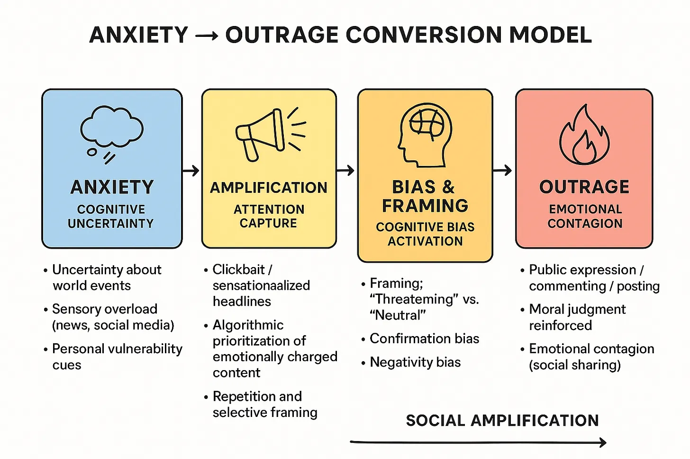

# The Lab Rat Chronicles

  <a href="./"><strong>Essays</strong></a> | 
  <a href="about/"><strong>About</strong></a>

Welcome to The Lab Rat Chronicles: a space for examining what happens when boundaries are pushed to their limits. Read more about this essay repository in the About Page.

<h2>Essays</h2>

<table>
  <tr style="background-color: transparent !important;">
    <td style="width:320px; vertical-align:top;">
      
    </td>
    <td style="vertical-align:middle;">
      <strong>
        <a href="built_to_provoke/">Built To Provoke</a>
      </strong> 
      <em>How digital platforms learned to monetize your emotions.</em>
    </td>
  </tr>

  <tr style="background-color: transparent !important;">
    <td style="width:320px; vertical-align:top;">
      
    </td>
    <td style="vertical-align:middle;">
      <strong>
        <a href="dopamine_economics/">Dopamine Economics: The Short-Term High of Outrage</a>
      </strong> 
      <em>What happens when ancient emotional circuits collide with modern algorithmic incentives.</em>
    </td>
  </tr>
</table>

